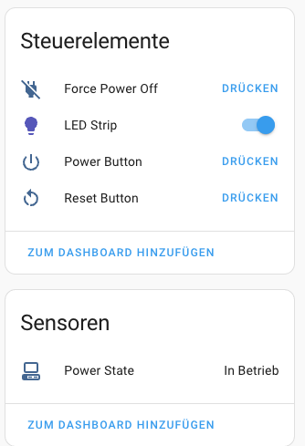
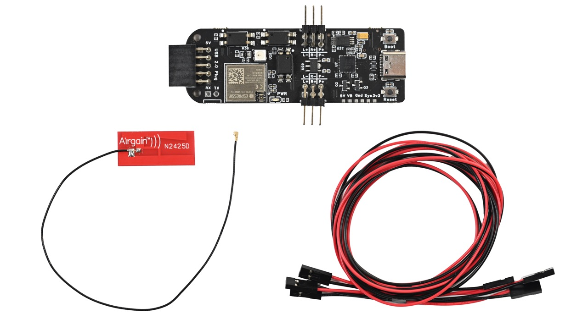
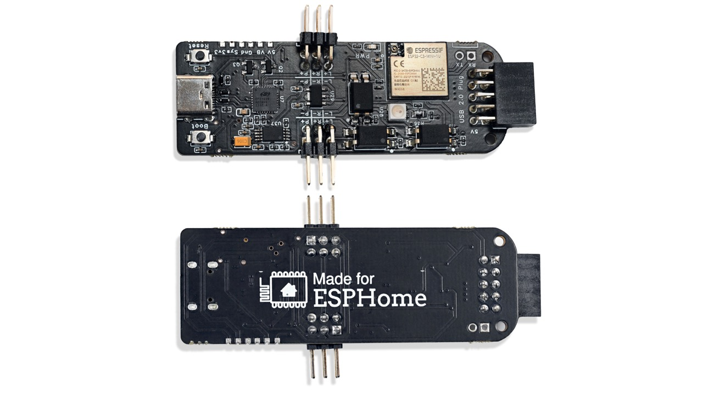

# PokyPow


Remote shutdown and start you PC/server with Home Assistant.

> [!NOTE]  
> The [CrowdSupply campaign for PokyPow launch site](https://www.crowdsupply.com/ajfriesen/pokypow) is live!
> We need 200 subscribers in order to go to the next steps.
> Subscribe and make it real!

Powered by ESPHome.



Just connect your power, reset and power led front panel connector to appropriate pin pairs, power the PokyPow via USB-C or an internal USB2.0 header. 
Now you can turn on/off your PC and check if it is running via Home Assistant.

## Use cases

- Hide your PC in a closet or on a shelf without the need to press the actual button. You can just connect any other button via home assistant
- Setup automation based on time, motion or the moon phase, or whatever you like to power on your PC
- No funky magic packets anymore with flaky wake on LAN (never worked for me)
- No addons with admin access (password) to your Windows PC
- Add voice commands via Home Assistant to Google Assistant






# Project Documentation

You can find all product documentation, related blog post on my dedicated [PokyPow Documentation](https://pokypow.com/docs).

# Developer Docs

Build:

```
docker run --rm --privileged -v "${PWD}":/config -it ghcr.io/esphome/esphome:2026.1.2 compile ESPHome/pokypow.yaml
```
