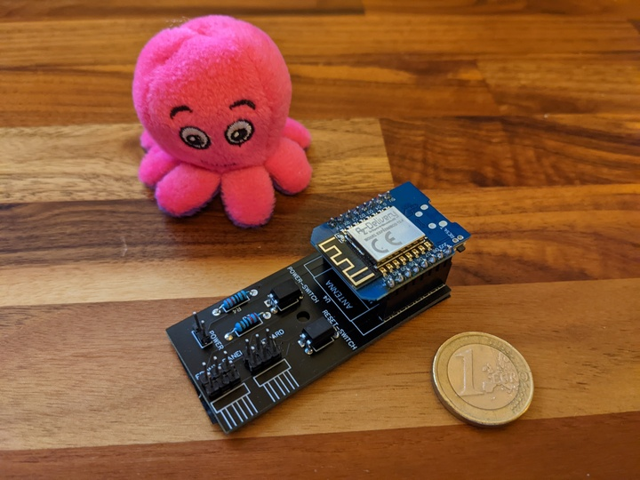
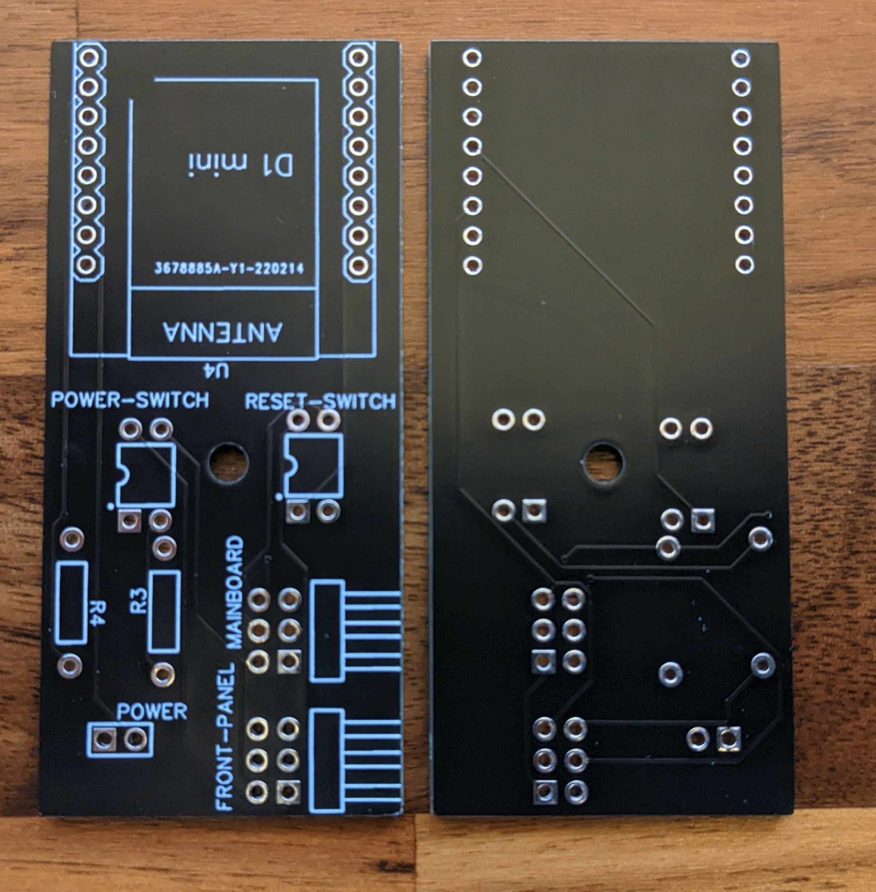
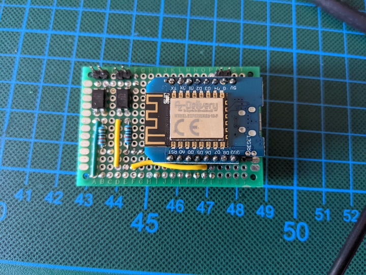

# pc-switch

Remote shutdown and start you PC/server with Home Assistant.

Powered by ESPHome. 

Just connect your power, reset and power led front panel connector to appropriate pin pairs, power the ESP8266 and you can turn on and off your PC via Home Assistant.

## Use cases

- Hide your PC in a closet or on a shelf without the need to press the actual button. You can just connect any other button via home assistant
- Setup automation based on time, motion or the moon phase, or whatever you like to power on your PC
- No funky magic packets anymore with flaky wake on LAN (never worked for me)
- No addons with admin access (password) to your Windows PC
- Add voice commands via Home Assistant to Google Assistant

# Project Documentation

You can find all product documentation, related blog post on my dedicated [pc-switch website](https://www.ajfriesen.com/pc-switch/).

