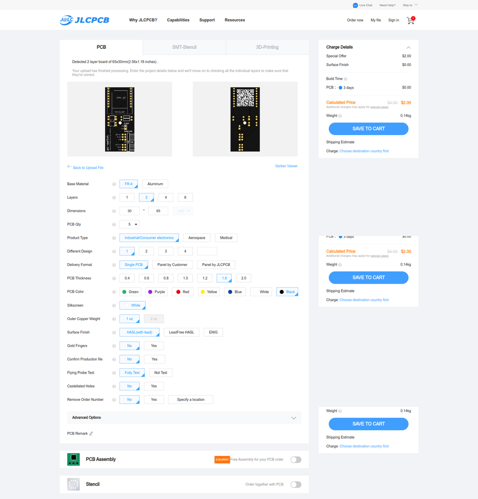
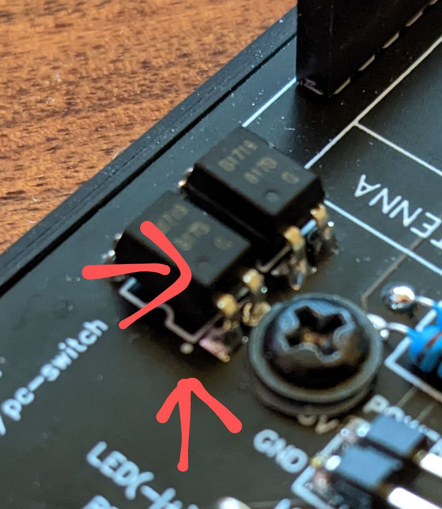

## Prerequisites

For DIY you need a basic soldering setup:

- Soldering iron
- solder
- optional but highly recommended: A soldering helper/hand
  
## Parts needed for the PCB

- WEMOS D1 mini (The ESP8266-12F from AZDelivery is a popular clone here in Germany)
- 2 x Optocoupler EL817
- 2 x Resistor 220 Ohm
- Pin header for power pins: 2x1, you can use straight or angled versions
- Pin headers for front panel connectors: 3x2 pin headers, you can use straight or angled versions
- Pin headers for motherboard:
  - 3x2 pin headers, you can use straight or angled versions

## Additional parts for connecting the pc-switch

- 6 x female-to-female jumper cables to connect to the motherboard
- 6 x female-to-male jumper cables to connect to the front panel connectors
- 2 x female-to-female jumper cables to connect to power (use USB or other pins from your motherboard which are always on)

## Ordering the PCB

Download the Gerber file
Got to https://cart.jlcpcb.com/quote
Upload the file and adjust your order

## Soldering
Resistors can be soldered either way, you can not do anything wrong here.
Optocouplers need a specific orientation. You need to align the small circles on the board with the circles on the optocoupler.

## Flashing the software

1. I think it goes without saying but you need Home Assistant running somewhere.

2. Install the ESPHome Add-On:

3. Plug in the device via USB to your PC or the PC which is running Home Assistant

4. Copy and paste the YAML from GitHub: https://github.com/ajfriesen/pc-switch

5. Now your pc-switch should pop up automatically in the device section

## Connecting to a PC or Server

1. Check if your motherboard supports always-on USB and enable it if possible(sometimes this setting is in a really weird spot)
2. Connect your pc-switch to some USB header for power. Check the pins on your motherboard manual. You just need to use 5V and GND. (If you don't have always-on power you can run a USB micro cable into your case as well)
3. Connect Reset, Power and Power LED with your board.
4. If you want to use the power button and power led on your PC case then connect those as well.

Now enjoy automating your PC.

- Turn it off or on at a specific time
- Add another button (like the  Aqara ones) to Home Assistant and use that for power on/off
- Connect your voice assistant like Google Home to that switch with Home Assistant (That is what I did🙂)
