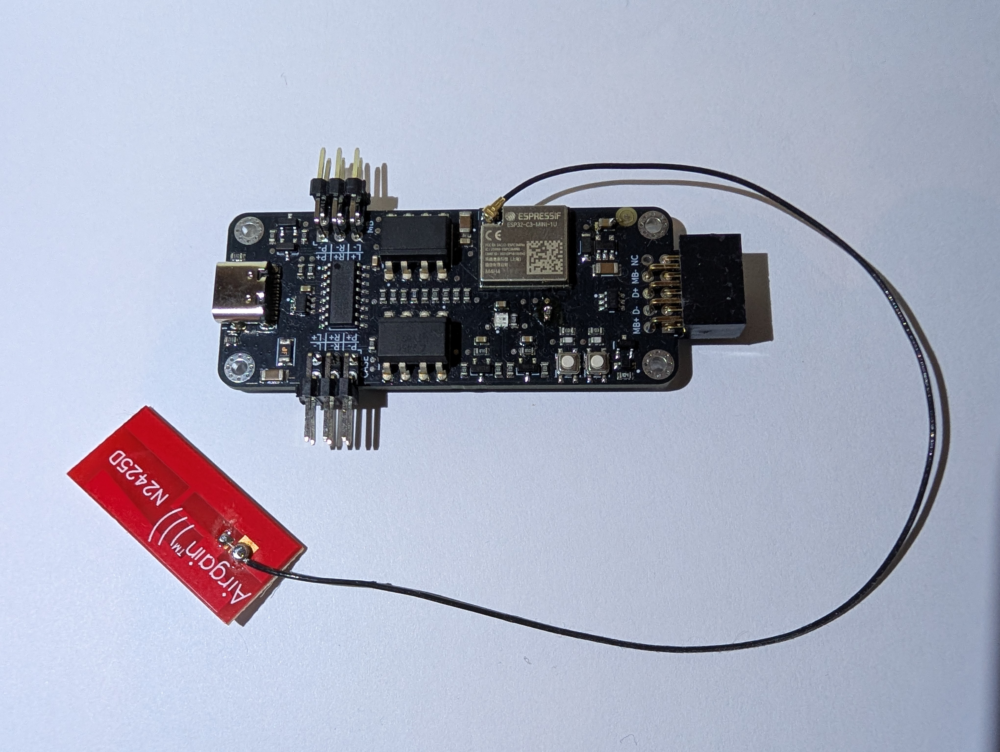
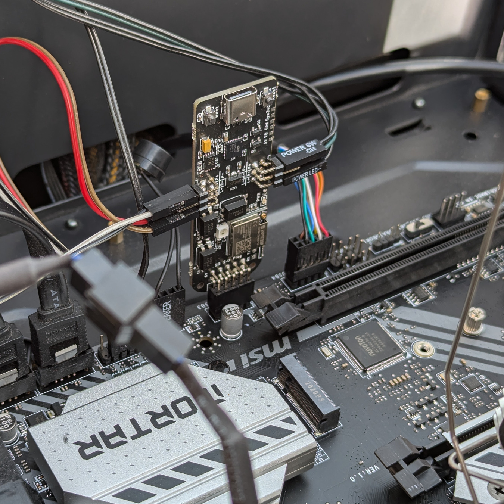
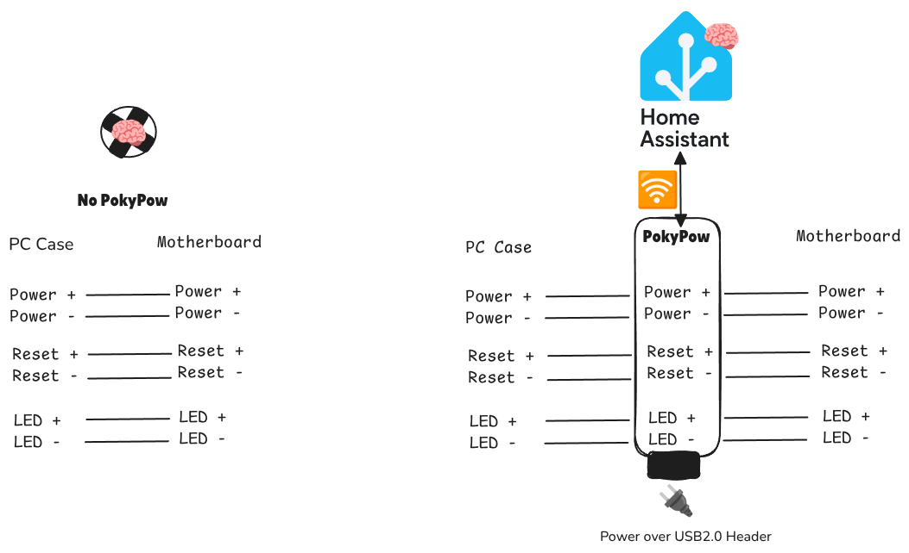
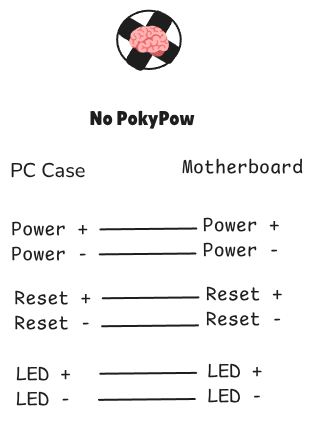
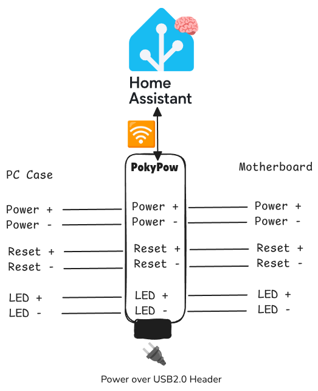
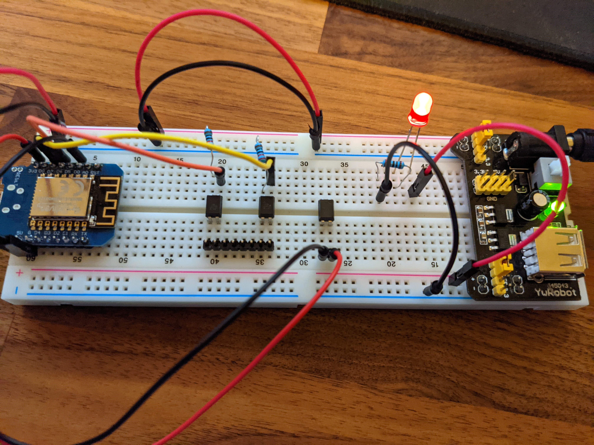
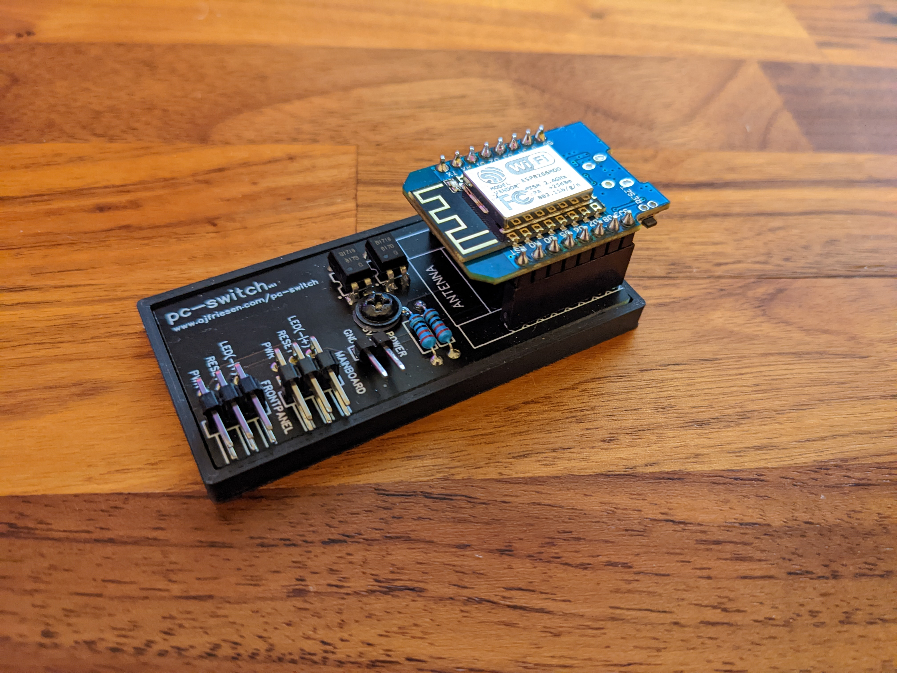

# Media & Press

PokyPow is a remote power control and monitoring device for any desktop PC.
 
Specifically designed for Home Assistant users.
 
You can also lock the physical buttons on your PC, which is perfect for parental control or curious cats!

## Images

{ width="500" }

/// caption
PokyPow with external antenna
///

{ width="500" }

/// caption
PokyPow plugged into a USB 2.0 header on the motherboard
///

{ width="500" }

/// caption
PokyPow in Home Assistant
///

{ width="500" }

/// caption
PokyPow updates in Home Assistant
///

{ width="500" }

/// caption
PokyPow Diagram
///

{ width="500" }

/// caption
Without PokyPow
///

{ width="500" }

/// caption
With PokyPow
///

## Story

A friend wanted to turn his VR PC, located in a cupboard, on and off using his smart home.

However, he didn't want to install another app, create an account, or be reliant on a cloud service.
Wake-on-LAN was possible but not reliable enough.
He wanted local control and to use Home Assistant.

Surprisingly, there was no off-the-shelf device available.

How hard can this be?

Knowing nothing about hardware design, Andrej started with a prototype on a breadboard, followed by hand-soldering on a prototype board.

{ width="500" }

/// caption
Prototype on breadboard
///

He then created the first PCB where you could simply plug in a Wemos D1 mini.

{ width="500" }

/// caption
First PC-Switch PCB
///

He attempted to create a version with an external antenna but failed miserably.

The project was paused indefinitely.
However, over time, more than 300 people subscribed to his blog because of PokyPow (formerly known as PC-Switch).

Then he came to the conclusion that he could simply pay a more experienced person to design the PCB.

{ width="500" }

/// caption
Several PC-Switch Iterations
///

With this design he could apply to CrowdSupply.
Crowd Supply is a curated, full-service crowdfunding and incubation platform for hardware creators.

To his suprise, they accepted!

## Facts

- **Microcontroller**: ESP32-C3-MINI-1U
- **Antenna**: External antenna for better signal
- **Firmware**: ESPHome
- **Flashing**: Over USB-C
- **Updates**: OTA (Over-The-Air) updates available via Home Assistant 
- **Power**:
    - USB 2.0 header from motherboard
    - USB-C port powered by PC
    - USB-C port powered by external power supply
- **Features**:
    - Power on/off
    - Reset
    - Force reset
    - Monitor if the PC is on or off
    - Lock the buttons on the PC
    - Set a schedule for when you or your kids can use the PC (with Home Assistant)
    - Automatically start or stop your PC (with Home Assistant)
- Documentation: [https://pokypow.com/docs](https://pokypow.com/docs)
- Crowd Supply campaign: [https://www.crowdsupply.com/ajfriesen/pokypow](https://www.crowdsupply.com/ajfriesen/pokypow)
- Code: [https://github.com/ajfriesen/pokypow](https://github.com/ajfriesen/pokypow)

## About the Creator

Andrej Friesen has been working in the hosting industry for several years.
His roles have included tasks in the DevOps field and team leadership.

He is in his late 30s and lives with his girlfriend and daughter near Cologne.

He runs a German podcast about smart homes, self-hosting, Linux, and tech with a friend.
Additionally, he is passionate about Home Assistant and organizes Home Assistant meetups in his area.

On February 21, 2026, 180 Home Assistant enthusiasts will gather together.

{ width="500" }

/// caption
Andrej Friesen, creator of PokyPow
///

## Download Images

[Download High-Resolution Images](./pokypow-images.zip){ .md-button }
